**GSB 5544 · Computing and Machine Learning for Business Analytics**

*Read before class and run the code as you go, on your laptop. In class you will run the same code on a machine you rent from AWS and put the two side by side. The practice activity assumes you have done both.*

---

## Why this matters for a business analyst

Every dataset you have used in this course so far arrived as a file you opened. That is not how data arrives in practice. The sales history, the clickstream, the sensor log, the claims table: they live somewhere else, they are usually larger than your machine, and someone has to decide *what to bring over* before any modeling begins.

There is a second decision hiding behind the first one: *where should the code run?* Until now the answer was always "on my laptop," because that was the only computer you had. In the cloud, **storage and compute are both things you rent.** The data sits in a bucket. The computer that reads it can be your laptop, a rented machine sitting in the same building as the bucket, or a fleet of machines that runs one SQL statement and hands you back only the rows that matched.

Every cloud decision comes down to three questions, and you will ask them repeatedly in this module:

- **Space.** How much data is there, and where does it live?
- **Ability.** How much computer do I need to work on it, and for how long?
- **Cost.** What does that space and ability cost per hour, per gigabyte, per query?

This reading gives you four things:

1. A way to measure what a machine can hold, so you can compare your laptop to a rented one.
2. The vocabulary to describe the size of data and the parts of a cloud system.
3. A working pattern for reading only what you need from a large remote dataset.
4. A way to run the same notebook on a machine next to the data, and to know what it costs.

We will use weather data as the example. Weather is one of the most common external covariates in business analytics: it drives beverage and apparel demand, energy load, insurance claims, delivery times, and foot traffic. It is also a dataset that is far too large to open on a laptop, which is exactly the point. Our example location is close to home: the weather station at Cal Poly in **San Luis Obispo (SLO)**, which has recorded daily weather since 1893.

---

## Before you start: open a notebook in Positron

This reading has code in it, and you run that code as you read. All of it goes into **one new notebook in Positron, on your laptop**. Create it now, before section 1, so it is open and waiting the first time you meet a code block.

::: {.callout-note title="Where to save your work: two cases"}
- **If your section set up a course folder** (a folder named like `GSB-5544-Fall-2026-ijw` with a `practice_activities` folder inside it), you already know where things go. Save this notebook under `practice_activities/week_7` as usual and skip the folder explanations in steps 1 and 3.
- **If your section did not**, you need one folder to hold this week's work, and any location you can find again is fine. Create a folder named `GSB-5544` on your Desktop or in Documents, and inside it a folder named `week_7`. Steps 1 and 3 refer to this folder.
:::

1. **Open Positron and open your course folder.** Choose **File → Open Folder** and pick your course folder: the one your section set up, or the `GSB-5544` folder you just created.
2. **Create the notebook.** Click the **New** button (the **+** in the top-left corner), choose **New File...**, and pick **Jupyter Notebook** from the list that drops down.

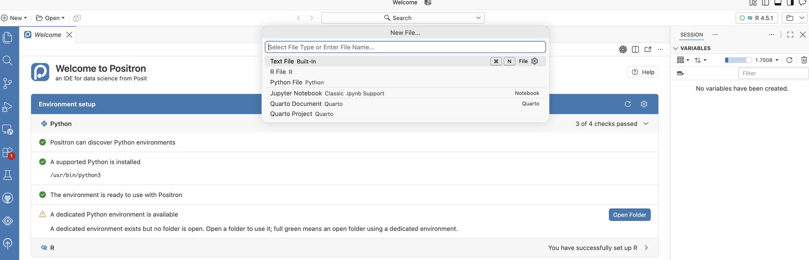{fig-alt="Positron Welcome page with the New File menu open, listing Text File, R File, Python File, Jupyter Notebook, Quarto Document and Quarto Project."}

3. **Save it under week 7.** Press Cmd+S (Ctrl+S on Windows) and name the notebook `week_7_preclass_reading.ipynb`. Save it in your `week_7` folder: `practice_activities/week_7` if you use the course folder layout, or the `week_7` folder you created above. With the course folder layout, the full path looks like mine: `/Users/immanuelwilliams/Desktop/GSB-5544-Fall-2026-ijw/practice_activities/week_7/week_7_preclass_reading.ipynb`.
4. **Pick Python.** If the notebook asks you to select a kernel (top right of the notebook), choose the Python you use for this course.

5. **Install the packages.** Copy this into the first cell and run it with Shift+Enter. The `%pip` form installs into the same Python the notebook is using. You only need to do this once.

```python
# RUNS ON: laptop
%pip install boto3 fsspec s3fs psutil pandas matplotlib
```

If a later cell stops with `ModuleNotFoundError` or `ImportError`, the install did not reach the Python your notebook is using. Run this cell again, restart the kernel (the **Restart** button at the top of the notebook), and rerun your cells from the top.

Keep Positron open for the rest of the reading. How to use the notebook as you go:

- **Copy each code snippet from this page into its own cell**, in the order it appears, and run it with Shift+Enter. Every code block on this page has a copy button in its top-right corner.
- **Run the cells top to bottom.** Later cells use names that earlier cells created (`human`, `s3`, `BUCKET`, `COLS`, `STATION`, `df`). If you see a `NameError`, a cell above was skipped.
- **Read the "What this code does" notes** under the snippets after you run them, and compare them with the output you got. The goal is that you can explain each cell, not only that it ran.

### Two places you will work, and how to tell which one you are in

This reading moves between two places. Coloured boxes mark every switch, and each one says why you are switching.

| The box says | Where you are | What you do there | Why |
|---|---|---|---|
| **In your notebook** | Positron, on your laptop | Copy a snippet into a cell and run it | The code runs on your own machine, so the numbers you record describe your laptop. Nothing here costs money or needs an AWS account |
| **Detour: AWS website** | Your web browser, signed in to AWS | Click through setup pages. No code, nothing typed into the notebook | The account and the rented machine have to exist before class, and they can only be created on AWS's own site |
| **Reading only** | This page | Read. Nothing to run or click | The section explains ideas or vocabulary you need for what comes next |

The code blocks carry the same information in their first line. `# RUNS ON: laptop` means the notebook in Positron. Any other value (`SageMaker`, `Athena`) means the code runs on AWS in class, and you do not copy it into your notebook now.

One thing to watch for in class: JupyterLab inside SageMaker looks almost identical to a notebook on your laptop, but it lives in a browser tab and runs on the rented machine. The look of the notebook does not tell you where the code runs. The place it was opened from does.

---

## 1. What your machine actually has

::: {.callout-tip title="In your notebook · Positron, on your laptop"}
Sections 1 and 2 are your first cells. **Why the notebook?** You are measuring your own machine, so the code has to run on it. You will reuse these cells' results all the way through section 6.
:::

Your laptop has an amount of memory (RAM) installed, and a smaller amount that is *available right now*. The available number is the one that determines whether a dataset loads. Measure it:

```python
# RUNS ON: laptop
import psutil

vm = psutil.virtual_memory()
du = psutil.disk_usage("/")

print(f"Physical cores : {psutil.cpu_count(logical=False)}")
print(f"Logical cores  : {psutil.cpu_count(logical=True)}")
print(f"Total RAM      : {vm.total / 1e9:.1f} GB")
print(f"Available RAM  : {vm.available / 1e9:.1f} GB")   # the number that matters
print(f"Free disk      : {du.free / 1e9:.1f} GB")
```

**Write all five numbers down.** In class you will run this exact cell a second time inside a rented AWS machine and put the two columns next to each other. The lesson of that comparison is the lesson of the whole module: *the machine running your code is a choice, and you can change it.*

| | Laptop (now) | SageMaker (in class) |
|---|---|---|
| Physical cores | | |
| Logical cores | | |
| Total RAM (GB) | | |
| Available RAM (GB) | | |
| Free disk (GB) | | |

Two things people get wrong here:

- **Total is not available.** A 16 GB machine running a browser, Slack, and a notebook server often has 3–5 GB actually free.
- **Disk is not memory.** A 1 TB drive does not mean you can *analyze* 1 TB. pandas works in memory, and memory is the smaller number.

---

## 2. The units of data

You need to be fluent in these. Every size you will see in a cloud console, a bill, or an error message uses them.

| Unit | Bytes | Something that size |
|---|---|---|
| bit | 1/8 byte | One yes/no |
| byte (B) | 1 | One character |
| kilobyte (KB) | 1,000 | A paragraph |
| megabyte (MB) | 1,000,000 | A phone photo; a semester's worth of survey data |
| gigabyte (GB) | 1,000,000,000 | A year of daily weather readings, worldwide |
| terabyte (TB) | 1,000,000,000,000 | A large retailer's transaction history |
| petabyte (PB) | 1,000,000,000,000,000 | A web-scale crawl |

Two conventions coexist. Storage vendors and cloud consoles mostly use base 1000 (1 KB = 1,000 B). Operating systems and memory often use base 1024 (1 KiB = 1,024 B). This is why a "1 TB" drive shows as 931 GB in your file browser. Neither is wrong; you just need to know which one you are reading.

A helper you will use constantly:

```python
# RUNS ON: laptop
def human(n, base=1000):
    """Turn a byte count into a readable string."""
    for unit in ["B", "KB", "MB", "GB", "TB", "PB"]:
        if n < base:
            return f"{n:,.1f} {unit}"
        n /= base
    return f"{n:,.1f} EB"

human(1_500_000)        # '1.5 MB'
human(1_336_457_184)    # '1.3 GB'
```

### File size is not memory size

A CSV that is 800 MB on disk will not be 800 MB in pandas. Text columns are stored as Python objects, each with overhead, and pandas commonly needs 2–5× the on-disk size to hold a mostly-text CSV. Check what a DataFrame really costs with:

```python
# RUNS ON: laptop
df.memory_usage(deep=True).sum()   # deep=True, or string columns are undercounted
```

Do not run this one yet. There is no `df` in your notebook until section 6; come back and try it once that table exists.

So the question "does this fit?" is really: *is (file size × a multiplier) less than my available RAM?* When the answer is no, you have two choices, and this module teaches both. You can make a **smaller extraction**, or you can rent a **bigger machine**. Usually you do the first before the second, because the first is free.

---

## 3. The vocabulary of AWS

::: {.callout-note title="Reading only · nothing to run or click"}
Leave the notebook open and read. Section 3 and the first half of section 4 are vocabulary and ideas. **Why stop coding?** The AWS website and the code in sections 5 and 6 use these words without explaining them.
:::

Amazon Web Services is the largest cloud provider, and its vocabulary has become the industry's vocabulary. Eleven terms cover most of what you will read in documentation, pricing pages, and error messages.

| Term | What it is | The confusion it prevents |
|---|---|---|
| **Region** | A geographic cluster of data centers (`us-east-1`, `us-west-2`) | Why a bucket "doesn't exist": you are looking in the wrong region |
| **S3** | Simple Storage Service. Object storage, not a filesystem | Why there are no real folders, only names that contain slashes |
| **Bucket** | A named container for objects. Names are globally unique across all of AWS | Why `my-data` is already taken by a stranger |
| **Object** | One stored item plus its metadata (size, last modified, type) | Why you can read an object's size without downloading it |
| **Key** | The object's full name within the bucket, e.g. `csv/by_year/2024.csv` | Why that is one string, not three folders and a file |
| **Prefix** | The start of a key, used to list "everything under" something | How S3 fakes folders |
| **EC2** | Elastic Compute Cloud. A rented virtual computer | What "compute" means as distinct from "storage" |
| **Instance type** | The size of a rented computer: cores, RAM, and a price per hour. `ml.t3.medium` is 2 cores, 4 GB, about $0.05 per hour | Why "run it in the cloud" is not one thing; you choose how much machine |
| **Athena** | A SQL engine that runs a query across many machines directly against files in S3 and bills per byte scanned | How a `WHERE` clause can run on AWS's fleet instead of on your machine |
| **IAM** | Identity and Access Management. Who may do what | Why code gets `AccessDenied` even on public data |
| **Credentials** | The keys that identify you to AWS | Why "unsigned" or "anonymous" requests exist, and when you need to sign one |

The single most important idea underneath all eleven: **storage and compute are separate, and both are rented.** Data sits in S3. Computers reach into S3 for it. The computer can be your laptop, an instance you rent for the afternoon, or a fleet you rent for eight seconds. The data does not move; you decide what reaches for it.

---

## 4. Where does the code run?

Three definitions, then a walkthrough.

**Kernel.** The process that actually executes your notebook cells. When you press Shift-Enter, the browser sends the cell to a kernel and the kernel sends back the output. The browser and the kernel do not have to be on the same computer. So far in this course they have been.

**Instance.** A rented computer with a fixed number of cores and a fixed amount of RAM, billed by the hour while it is running. When you run a notebook in Amazon SageMaker Studio, the kernel lives on an instance in an AWS data center, and your laptop becomes a browser tab.

**Region co-location.** Putting the instance in the same region as the bucket. The GHCN bucket is in `us-east-1`, so our instances are in `us-east-1`. Inside one region, S3 and the instance are connected by AWS's own network: reads are fast and the data transfer is free. Across the public internet to your laptop, the same read is slower and, past a free allowance, AWS charges for every gigabyte that leaves. Same code, same file, different bill.

### The `# RUNS ON:` convention

From here on, **every code cell in this module starts with a comment that says where it executes.** There are exactly three values. (This block only shows the three labels; it is not a cell to copy into your notebook.)

```python
# RUNS ON: laptop
# RUNS ON: SageMaker ml.t3.medium (us-east-1)
# RUNS ON: Athena fleet (results land in S3)
```

The habit matters more than the syntax. An analyst who cannot say where a piece of code runs cannot say what it costs, how long it will take, or why it failed.

### How much machine: the ability you are renting

An instance type is a menu item. Prices are approximate, for `us-east-1`, at the time of writing; the SageMaker pricing page has the current numbers.

| Instance type | Cores | RAM | Approx. price per hour | Comparable to |
|---|---|---|---|---|
| `ml.t3.medium` | 2 | 4 GB | $0.05 | A budget laptop; our default |
| `ml.t3.xlarge` | 4 | 16 GB | $0.20 | A good laptop |
| `ml.m5.4xlarge` | 16 | 64 GB | $0.92 | A workstation |
| `ml.m5.24xlarge` | 96 | 384 GB | $5.53 | A server rack you would never buy for one project |

Read the table two ways. First, a bigger machine is one dropdown away and costs dollars per hour, not thousands up front. Second, the small one is enough for almost everything in this module, because the reading pattern in section 6 keeps the data small. Rent ability when extraction is not enough, not instead of it.

### Getting onto AWS: a free account and a SageMaker Studio space

::: {.callout-warning title="Detour: AWS website · in your web browser"}
**Leave the notebook alone for parts A through E.** Everything here happens in your web browser on AWS's own site. You click through pages; you write no code and type nothing into the Positron notebook. Keep Positron open in the background, because you return to it in section 5.

**Why the detour?** The code you have run so far used your laptop. In class the same code will run on a machine you rent from AWS, and that machine cannot be created from a notebook on your laptop. It needs an AWS account and a one-time setup, both done on the AWS site, and both take long enough that they need to be finished before class.

**How to tell you are on the AWS site:** the address bar reads `aws.amazon.com` or `console.aws.amazon.com`, or, inside Studio, an address containing `sagemaker`. In step 16 you will meet JupyterLab running *on AWS*, in a browser tab. It looks like your Positron notebook, but it is not the same notebook and it is not on your laptop.
:::

This module runs on AWS through a **free AWS account**. A new account starts on AWS's **Free Plan**: you receive $100 of credits that last six months, everything you run spends from those credits, and when the credits or the six months run out the account is paused rather than billed. Nothing in this module comes close to spending them if you stop your machine when you finish. The console changes its labels from time to time; follow the on-screen names if they differ slightly from these.

Do parts A through C, and part F, **before class**, ideally a few days before. Account activation and the one-time SageMaker setup each take several minutes, and you do not want to be waiting on them while everyone else is running code.

#### Part A. Create the free account (once)

1. **Go to** [aws.amazon.com/free](https://aws.amazon.com/free) and click **Create a free account**. Use an email address you will still have next year. Give the account a name; any name works, and it appears in the top-right corner of the console afterwards.
2. **Verify the email and fill in your details.** AWS emails a verification code, then asks for a root-user password, your name, address, and phone number. Choose **Personal** as the account type.
3. **Payment card.** AWS asks for a card to confirm your identity. On the Free Plan the card is not charged; the credits are the only thing that gets spent. If you are asked to choose between a **Free** and a **Paid** plan, choose **Free**. A phone verification follows: AWS texts or calls you with a code.
4. **Sign in** at [console.aws.amazon.com](https://console.aws.amazon.com) as the *root user*, with the email and password you just set. A brand-new account can take a few minutes to activate; if sign-in fails right away, wait and try again.

#### Part B. Read the Console Home before you click anything

The first page after sign-in is **Console Home**. It is busy. Two things on it matter for this module; ignore the rest, including Amazon Q, the "Recently visited" panel, and any banners.

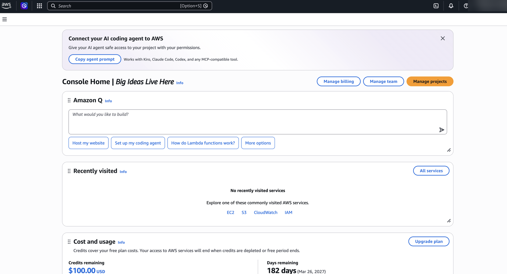{fig-alt="AWS Console Home showing the Amazon Q panel, an empty Recently visited panel, and a Cost and usage panel reading $100.00 credits remaining and 182 days remaining."}

- **Cost and usage**, lower on the page. It shows **Credits remaining** (starts at $100.00) and **Days remaining** (starts near 182). This panel is your budget and your timer. The practice activity asks you to read these numbers before and after class, so **write both down now**.
- **The search bar** at the top. It is how you reach every service. Type a service name, press Enter, and pick the service (not the documentation link) from the results.

Console Home does not show which **region** you are in. You will check the region in part C, on the SageMaker page, where it does appear.

#### Part C. Set up SageMaker Studio (once)

5. In the search bar type **SageMaker AI** and open it. There is also a plain "SageMaker" entry; the one you want is **SageMaker AI**.
6. **Check the region before you create anything.** Look at the address bar of your browser: the address should begin with `us-east-1.console.aws.amazon.com` and contain `region=us-east-1`. On service pages like this one the region also appears as a menu in the top bar, next to your account name, and it should read **US East (N. Virginia)**. If you see any other region, choose N. Virginia from that menu, or open [us-east-1.console.aws.amazon.com/sagemaker/home?region=us-east-1](https://us-east-1.console.aws.amazon.com/sagemaker/home?region=us-east-1) directly. The GHCN data lives in `us-east-1`; this is the co-location from the definitions above, and it also decides which price list you are on. Everything you create from here on is created in the region shown.
7. In the left menu, under *Applications and IDEs*, choose **SageMaker Studio**. On a new account the page shows a **Get Started** box with the button **Create a SageMaker domain**. Click it.

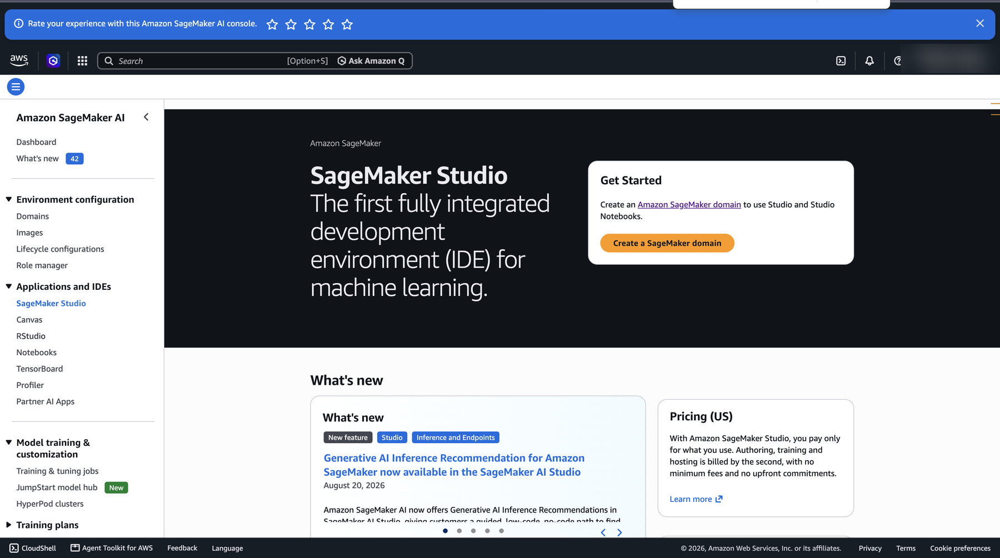{fig-alt="Amazon SageMaker AI console with SageMaker Studio selected in the left menu and a Get Started box containing the Create a SageMaker domain button."}
8. On the **Set up SageMaker domain** page, leave **Set up for single user (Quick setup)** selected and click **Set up** in the lower right. AWS creates a *domain* (the container for your Studio settings and files) and an *execution role* (the permissions your rented machine will have; the page calls it a new IAM role). Do not choose the organizations option.

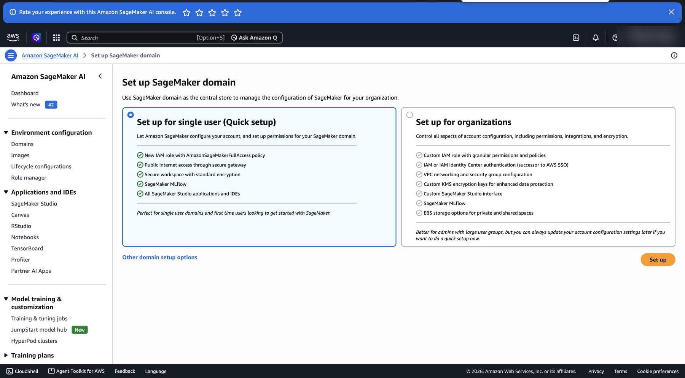{fig-alt="Set up SageMaker domain page with two cards, Set up for single user Quick setup selected, and an orange Set up button."}
9. A progress page appears while the domain is created. Keep the tab open until it finishes; the page says about 20 seconds, but allow a few minutes. When it lands you in Studio, the one-time setup is done. If instead you see a message that SageMaker is **not available on your plan**, stop here and tell me before class so we can arrange an alternative. Do not upgrade the plan on your own.

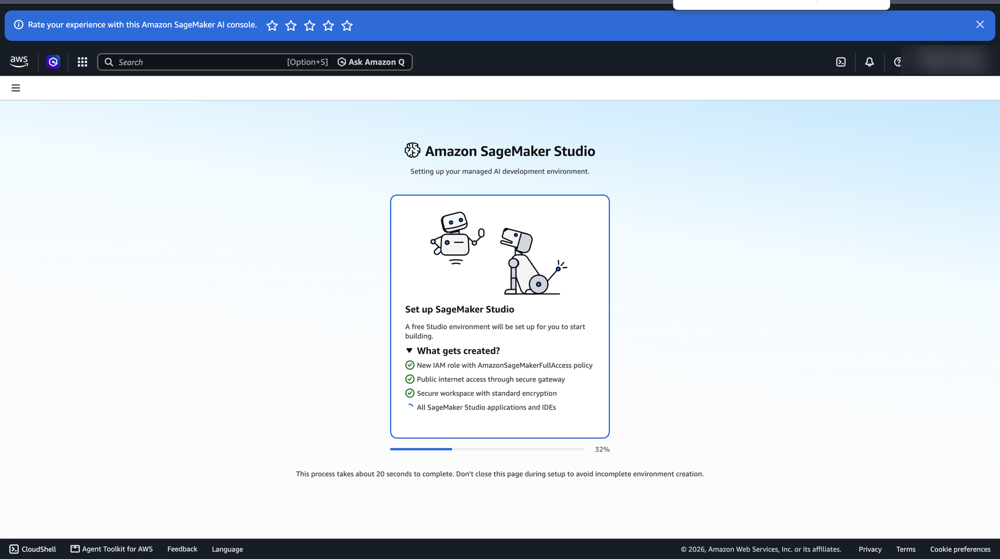{fig-alt="Amazon SageMaker Studio setup page listing what gets created, with a progress bar at 32 percent."}
10. The first time Studio opens, it offers a short **tour**. Go through it. It is only six slides about what Studio can do, and it names the parts of the screen you are about to use.

#### Part D. Create and run the JupyterLab space (each session)

11. Studio opens on its own **Home** page, a dark interface that looks nothing like the rest of the console. On later days, reach it from the SageMaker Studio page by clicking **Open Studio**. Under **Applications** in the top-left, click **JupyterLab**.

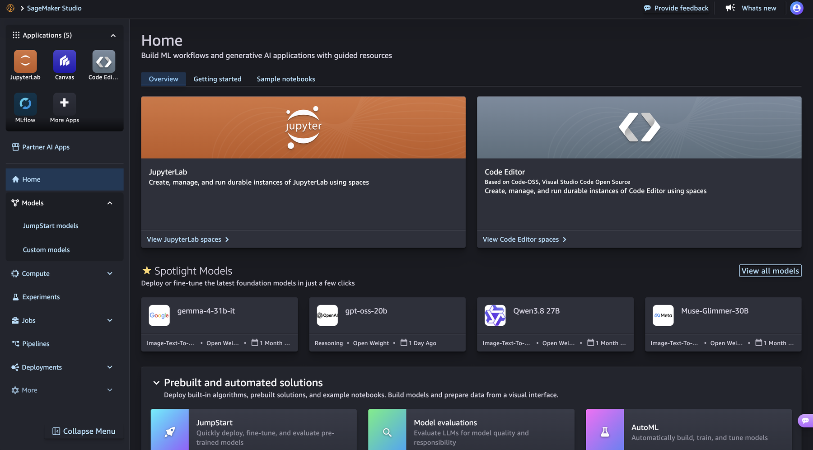{fig-alt="SageMaker Studio Home page with Applications tiles for JupyterLab, Canvas, Code Editor and MLflow, and a large JupyterLab card."}
12. The JupyterLab page lists your spaces; on the first visit it says *No JupyterLab spaces*. Ignore the **Space templates** and their *Launch now* links, which create a space with a generated name. Instead click **Create JupyterLab space** in the top right.

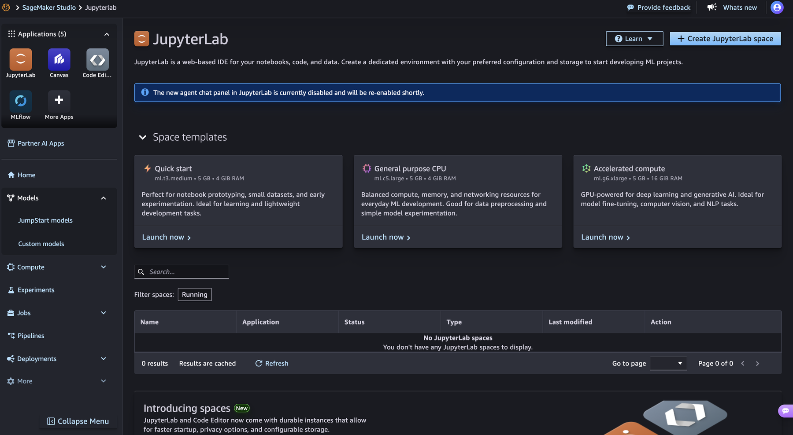{fig-alt="JupyterLab page in SageMaker Studio showing three space templates, an empty spaces table, and a Create JupyterLab space button."}
13. In the dialog, name the space `gsb5544`, leave **Private** selected, and click **Create space**.

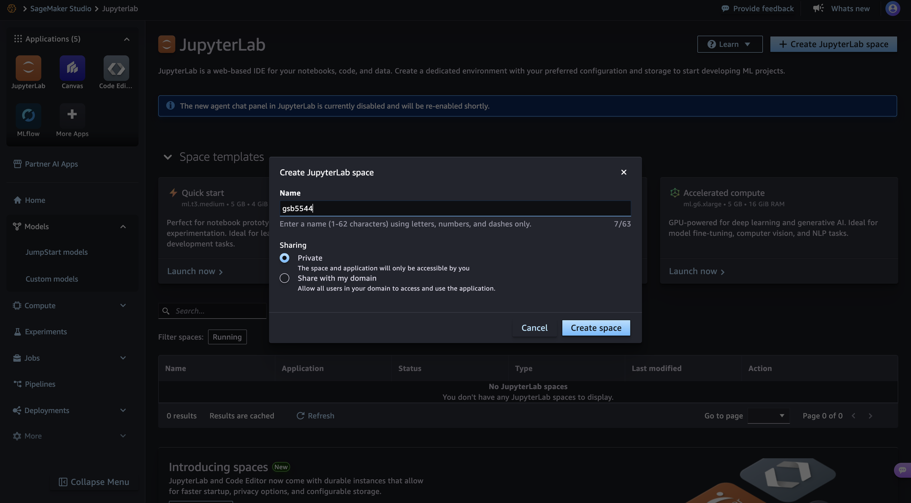{fig-alt="Create JupyterLab space dialog with Name set to gsb5544 and Sharing set to Private."}
14. The space's own page opens with status *Stopped*. Check three settings before you run it. **Instance** should read `ml.t3.medium` and **Image** should read *SageMaker Distribution* (the version number does not matter). Further down, change **Idle Shutdown (minutes)** from its default of 10080 (a week) to **60**, so a space you forget turns itself off after an hour. Leave **Storage** at 5 GB. Then click **Run space**.

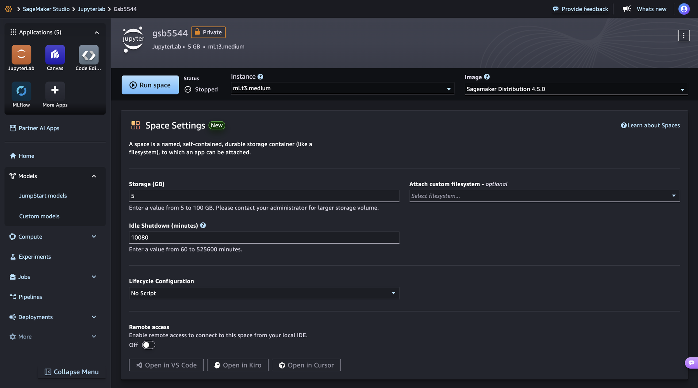{fig-alt="SageMaker Studio space page for gsb5544 showing a Run space button, status Stopped, Instance ml.t3.medium, Image Sagemaker Distribution 4.5.0, and space settings including Idle Shutdown of 10080 minutes."}
15. The status changes to *Starting* and a banner estimates the remaining time. It takes one to three minutes. When the space is ready, a green message at the bottom of the page reads *Successfully created JupyterLab app for space: gsb5544*, the status reads *Running*, and the **Run space** button becomes **Open JupyterLab**; click it. **The billing clock starts at *Running*.**

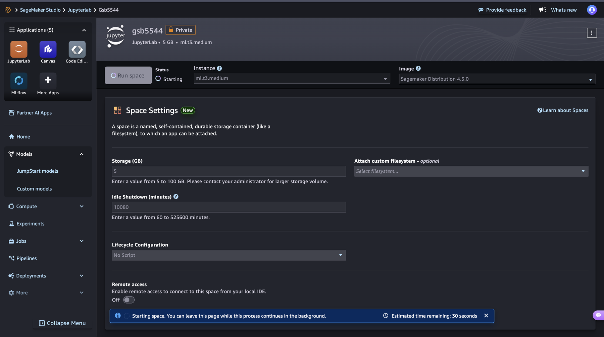{fig-alt="The gsb5544 space page with status Starting and a banner reading Starting space, estimated time remaining 30 seconds."}

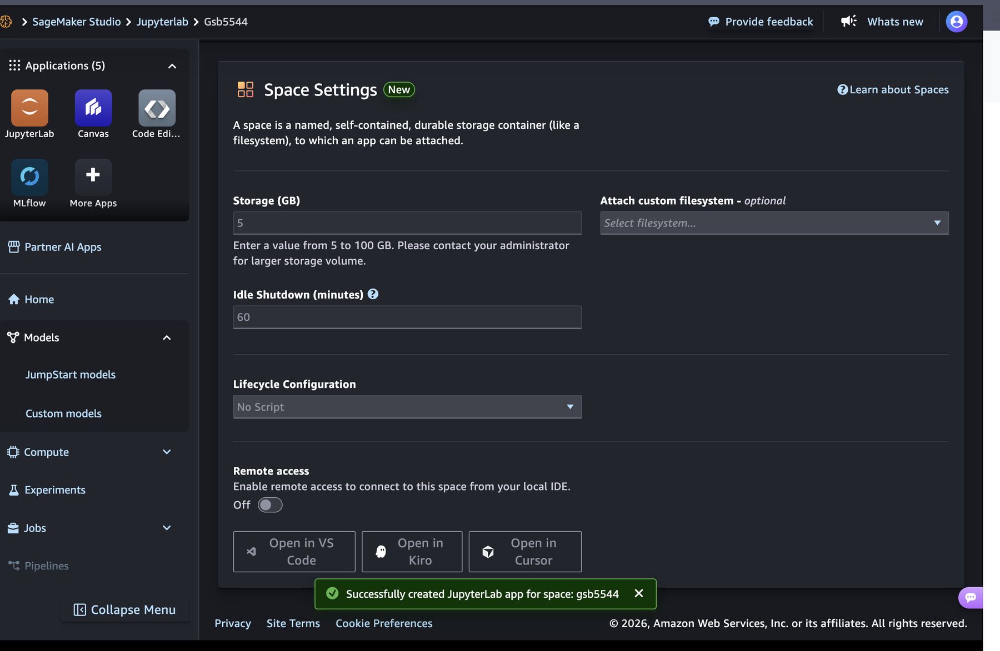{fig-alt="The Space Settings panel for gsb5544 with Idle Shutdown set to 60 minutes and a green message at the bottom reading Successfully created JupyterLab app for space: gsb5544."}
16. JupyterLab opens in a new tab. It is the same JupyterLab you have used on your laptop, except that the kernel now lives on the rented instance and your laptop is a browser tab. **Upload the two notebooks** for this session with the upload arrow in the left file browser, open the topics-of-practice notebook, and **run the `psutil` cell first**, before anything else. Fill in the right-hand column of the table in section 1.

#### Part E. Stop the space when you are done (every time)

17. Go back to the Studio tab, the one showing the `gsb5544` space page. If you have left that page, click **JupyterLab** under Applications and open `gsb5544` from the spaces table. Click **Stop space**, to the left of **Open JupyterLab**. A dialog asks you to confirm; click the red **Stop space** button in it. Wait until the status reads **Stopped**. A stopped space keeps your files and costs a few cents a month for storage. A running space costs the same whether or not you are typing. The dialog also warns that S3 buckets created from Studio are not deleted when the space stops. That is why the teardown in section 7 empties the results bucket as its own step.

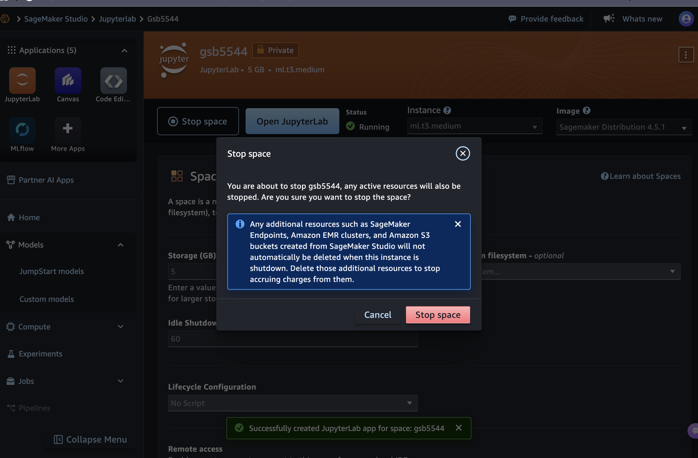{fig-alt="The gsb5544 space page with status Running, a Stop space button next to Open JupyterLab, and a Stop space confirmation dialog with Cancel and Stop space buttons."}
18. Open [console.aws.amazon.com](https://console.aws.amazon.com) **in a new browser tab**, so that Studio and JupyterLab stay open in their own tabs, and read **Credits remaining** on Console Home again. Compare it with the number you wrote down in part B. A class session should show 15 to 30 cents of difference, sometimes zero because the panel updates with a delay. The practice activity ends with a graded shutdown check for exactly this reason.

#### Part F. Let your Studio role use Athena (once)

The Quick setup in part C gives your rented machine permission to use SageMaker and little else. Block J of the in-class notebook also needs to run Athena queries and to create and empty a results bucket. You add those two permissions once, in the console, and never again. Do this before class.

17. In the console search bar type **IAM** and open it. In the left menu choose **Roles**.
18. In the search box type `AmazonSageMaker`. Click the role the Quick setup created; its name begins with **AmazonSageMaker** and contains **ExecutionRole**. If more than one appears, open JupyterLab, run the cell below in a new notebook, and use the role name it prints.

```python
# RUNS ON: SageMaker ml.t3.medium (us-east-1)
import boto3
print(boto3.client("sts").get_caller_identity()["Arn"].split("/")[1])
```

19. On the role's page choose **Add permissions → Attach policies**. Search for and tick **AmazonAthenaFullAccess**, then search for and tick **AmazonS3FullAccess**. Click **Add permissions**.
20. Both policies now appear in the role's list. There is nothing to restart; the next cell you run has the new permissions.

These are broad permissions, chosen so that setup is two ticks and not a custom policy. They apply only inside your own account, which holds nothing but this course's work. Learner Lab accounts skip this part: their **LabRole** already has both.

::: {.callout-tip title="Lab, space, instance, domain: which word is which"}
- **Instance**: the rented computer, such as `ml.t3.medium`. It has the cores and RAM from the table above, and it bills by the hour while it runs.
- **Space**: SageMaker's name for one JupyterLab environment plus its storage. A space *runs on* an instance. The space is the thing you run and stop, with the **Run space** and **Stop space** buttons.
- **Domain**: the one-time Studio setup that holds your spaces and permissions. You create it once and never touch it again.
- **Learner Lab**: the classroom sandbox that AWS Academy gives to some courses. If you created your own free account, you do not have a lab, and there is no **Start Lab** button anywhere. Go straight to SageMaker.
:::

::: {.callout-note title="If you upgrade to a paid plan later"}
The Free Plan cannot run up a bill: when the credits are gone, the account pauses. A paid account can. Before you create anything on a paid account, set a **budget alarm**: in the search bar type *Billing*, open **Budgets**, choose **Create budget**, pick a monthly *cost* budget of $10, and add an email alert at 80%. Everything in this module costs under a dollar if you stop the space when you finish; the alarm is there for the day you forget.
:::

---

## 5. Reading from S3 without an account

::: {.callout-tip title="Back in your notebook · Positron, on your laptop"}
The AWS detour is over. Return to Positron and keep adding cells to the same notebook, below the `human()` cell from section 2. Sections 5 and 6 are marked `# RUNS ON: laptop` and run in that notebook, **not** in the JupyterLab space you just set up on AWS.

**Why here and not on AWS?** Before class you measure how this work goes on your own machine: how long it takes and how much memory it needs. In class you run the same cells inside JupyterLab on SageMaker and compare the two. Without the laptop numbers there is nothing to compare against. If your space is still running from the rehearsal, stop it (part E); you do not need it until class.
:::

Many large public datasets are hosted on S3, and they can be read *anonymously*: no account, no credit card, no credentials. The request is simply not signed. This works identically from your laptop and from inside SageMaker; only the network in between changes.

The [Registry of Open Data on AWS](https://registry.opendata.aws/) is the catalog where these public datasets are listed. It is a website to browse, like a library catalog. You do not work in it or sign into it, and nothing in this section requires you to open it; it is where we found the bucket name used below.

You installed the packages for this section in the first cell of your notebook. Inside SageMaker the default image already has all of them.

`boto3` is the official AWS library for Python. Create an unsigned client:

```python
# RUNS ON: laptop
import boto3
from botocore import UNSIGNED
from botocore.config import Config

s3 = boto3.client("s3", region_name="us-east-1",
                  config=Config(signature_version=UNSIGNED))
```

**What this code does.**

- `boto3.client("s3", ...)` builds a *client*: a Python object whose methods are the things you can ask S3 to do (list, read, describe). Creating it sends nothing over the network, so this cell prints no output.
- `region_name="us-east-1"` tells the client which region's S3 to talk to. It is the region where the bucket lives.
- `Config(signature_version=UNSIGNED)` tells the client not to attach any credentials to its requests. Normally every AWS request is signed with your keys; a public bucket accepts requests with no signature. This one argument is what "anonymous access" means in code.
- Every later cell uses this `s3` object, so this cell has to run first.

**NOAA** is the National Oceanic and Atmospheric Administration, the U.S. federal agency that collects and publishes weather and climate records. Our dataset is NOAA's **Global Historical Climatology Network – Daily (GHCN-D)**: daily observations from tens of thousands of weather stations worldwide, some going back to the 1760s. It lives in the bucket `noaa-ghcn-pds`.

Out of all those stations, this reading is after one: **the weather data for San Luis Obispo**. The station is on the Cal Poly campus, its ID is `USC00047851`, and its records start in 1893. Whenever the code below says "the station" or uses `STATION`, it means SLO's daily highs, lows, and rainfall. Everything in sections 5 and 6 is about getting those SLO rows out of a worldwide dataset without bringing the rest of the world along.

### Listing, not downloading

The first thing to do with any bucket is look at what is in it. `Delimiter="/"` asks S3 to group keys by their first path segment, which is how you see the "folders":

```python
# RUNS ON: laptop
BUCKET = "noaa-ghcn-pds"

resp = s3.list_objects_v2(Bucket=BUCKET, Delimiter="/")
print([p["Prefix"] for p in resp.get("CommonPrefixes", [])])
# ['csv.gz/', 'csv/', 'parquet/']

print([o["Key"] for o in resp.get("Contents", [])][:6])
# ['ghcnd-countries.txt', 'ghcnd-inventory.txt', 'ghcnd-states.txt', 'ghcnd-stations.txt', ...]
```

**What this code does.**

- `s3.list_objects_v2(Bucket=BUCKET, Delimiter="/")` sends one request that asks, "what is at the top level of this bucket?" The answer comes back as a Python dictionary, stored in `resp`. No file contents are transferred, only names and metadata.
- `resp["CommonPrefixes"]` holds the "folders": every distinct beginning of a key up to the first `/`. The first `print` pulls the `Prefix` out of each one.
- `resp["Contents"]` holds the objects that sit at the top level with no `/` in their key. The second `print` pulls out each `Key`, and `[:6]` keeps the first six.
- `.get("CommonPrefixes", [])` is a safe lookup: if the response has no such entry, you get an empty list instead of an error.
- The lines starting with `#` under each `print` are the output you should see. Check yours against them.

The `csv/` prefix contains two layouts of the same data:

- `csv/by_year/YYYY.csv` — every station, one year per file
- `csv/by_station/STATIONID.csv` — one station, every year in one file

The `parquet/` prefix contains the same data a third time, in a columnar format that SQL engines can read selectively. Its keys look like `parquet/by_year/YEAR=2024/ELEMENT=TMAX/…parquet`. That `YEAR=`/`ELEMENT=` pattern is not decoration; section 6 shows what it buys you.

### Reading a size without reading the file

Every object carries its size as metadata. You can read it for free:

```python
# RUNS ON: laptop
resp = s3.list_objects_v2(Bucket=BUCKET, Prefix="csv/by_year/202")
for obj in resp["Contents"]:
    print(f"{obj['Key']:<28} {human(obj['Size'])}")
```

```
csv/by_year/2020.csv         1.3 GB
csv/by_year/2021.csv         1.4 GB
csv/by_year/2022.csv         1.4 GB
csv/by_year/2023.csv         1.4 GB
csv/by_year/2024.csv         1.4 GB
csv/by_year/2025.csv         1.3 GB
csv/by_year/2026.csv         818.8 MB
```

**What this code does.**

- `Prefix="csv/by_year/202"` narrows the listing to keys that *begin with* that text, which here means the files for 2020 onward. A prefix is a filter that S3 applies on its side, before it answers.
- Each item in `resp["Contents"]` is a small dictionary describing one object. `obj["Key"]` is its name and `obj["Size"]` is its size in bytes.
- `human(obj["Size"])` is the helper from section 2; it turns `1336457184` into `1.3 GB`.
- `{obj['Key']:<28}` pads the name to 28 characters, left-aligned, so the sizes line up in a column.
- You have now learned that these files are over a gigabyte each, and you have downloaded none of them. The whole exchange was a few kilobytes of text.

Compare that to your available RAM from section 1, and remember the multiplier. One year of GHCN is a file most laptops cannot open with a plain `pd.read_csv`. Notice that an `ml.t3.medium`, with 4 GB, cannot open it either. Renting a machine did not change the arithmetic; only extraction or a much larger instance does.

For a single object, `head_object` returns the metadata alone:

```python
# RUNS ON: laptop
meta = s3.head_object(Bucket=BUCKET, Key="csv/by_year/2024.csv")
meta["ContentLength"], meta["LastModified"]
```

**What this code does.**

- `head_object` asks S3 for the *description* of one object without its contents. Think of reading the label on a box without opening it.
- `meta["ContentLength"]` is the size in bytes and `meta["LastModified"]` is when the file was last written.
- The last line has no `print`. A notebook displays the value of the last line of a cell on its own, so you see the two values as a pair.

### Reading a *slice* of a file

S3 supports HTTP range requests, so you can read the first few hundred bytes of a gigabyte file to see its shape:

```python
# RUNS ON: laptop
obj = s3.get_object(Bucket=BUCKET, Key="csv/by_year/2024.csv", Range="bytes=0-299")
print(obj["Body"].read().decode())
```

**What this code does.**

- `get_object` is the request that actually fetches file contents. Without `Range` it would start sending the whole 1.3 GB.
- `Range="bytes=0-299"` asks for bytes 0 through 299 only: the first 300 bytes of the file. S3 sends exactly that and stops.
- `obj["Body"]` is a *stream*, an open connection that you read from. `.read()` pulls the bytes off it, and `.decode()` turns raw bytes into text you can print.
- The output is the first handful of rows of the file. You can see the layout (station ID, date, element code, value, flags) after transferring 300 bytes instead of 1.3 billion.

Use this to check whether a file has a header row before you read it. If the first line begins with `ID,`, it does. Never assume either way; the check costs 300 bytes.

---

## 6. Extraction strategy: filter at the source

::: {.callout-warning title="Some cells in this section take a while. Be patient"}
The cells in section 5 answered in a second or two because they moved almost no data. Two cells in this section move real data and are slower:

- The **by-station cell** downloads a few megabytes. Expect several seconds, longer on a slow connection.
- The **timed cell** downloads 300 MB. Expect **about 3 minutes** on an ordinary home connection, and noticeably longer on slow Wi-Fi or on a laptop that is short on free memory or has an older or busy processor.

While a cell is working, the notebook shows it as running and prints nothing. That is normal. **Do not run the cell again and do not interrupt it**; starting over only makes the wait longer. Closing other programs and browser tabs helps if your machine is struggling. Use the wait to read ahead.
:::

When data does not fit, there are three levers, and they all express one principle: **move the filter to the data instead of moving the data to the filter.**

**Lever 1: pick the right object.** GHCN offers the same data by year (1.3 GB, all stations) and by station (a few MB, all years). If you need one location, read the station file. Choosing the object is the cheapest filter there is.

**Lever 2: read fewer columns.** `usecols` tells pandas to discard columns while parsing, so they never take memory.

**Lever 3: read fewer rows at a time.** `chunksize` returns an iterator of DataFrames; you filter each chunk and keep only what survives.

Here is the pattern, reading one station directly from S3. The GHCN CSV columns are, in order: station ID, date (YYYYMMDD), element code, value, and four flag columns.

```python
# RUNS ON: laptop
import pandas as pd

COLS = ["id", "date", "element", "value", "m_flag", "q_flag", "s_flag", "obs_time"]
STATION = "USC00047851"          # SAN LUIS OBISPO POLY, CA — records since 1893
key = f"csv/by_station/{STATION}.csv"

# Does the file have a header row? Read 100 bytes and look.
first = s3.get_object(Bucket=BUCKET, Key=key, Range="bytes=0-99")["Body"].read().decode()
has_header = first.upper().startswith("ID,")

obj = s3.get_object(Bucket=BUCKET, Key=key)
df = pd.read_csv(
    obj["Body"],
    header=0 if has_header else None,
    names=COLS,
    usecols=["id", "date", "element", "value"],     # lever 2
    dtype={"id": "string", "element": "string"},
)
df.shape
```

**What this code does.**

- `COLS` gives names to the eight columns, in file order. `STATION` is the ID of the one weather station we care about, and `key` builds the name of that station's file: `csv/by_station/USC00047851.csv`. This is **lever 1**: you chose the small object.
- The two lines after the comment repeat the range-request trick from section 5. They read the first 100 bytes and set `has_header` to `True` if the file begins with `ID,`.
- `s3.get_object(Bucket=BUCKET, Key=key)` has no `Range` this time, so it opens a stream for the whole file. That is fine here, because the file is only a few megabytes.
- `pd.read_csv(obj["Body"], ...)` reads the table straight off that stream. Nothing is saved to your disk.
- `header=0 if has_header else None` together with `names=COLS` says: use my column names, and if the file has its own header row, throw that row away instead of treating it as data.
- `usecols=[...]` is **lever 2**. pandas reads four of the eight columns and discards the flags as it parses, so they never occupy memory.
- `dtype={...}` stores the two text columns in pandas' compact string type.
- `df.shape` shows (rows, columns). You should see four columns and a row count in the hundreds of thousands: every daily measurement at this station since 1893.

For a by-year file, add lever 3 and keep only the rows you want as they stream past. The 2024 file holds every station in the world and is about 1.4 GB, which takes most home connections 10 to 15 minutes or more to pull down. You do not need to wait that long to learn what it costs. The cell below reads only the **first 300 MB** of the file, times that, and scales the result up to estimate the whole file.

**Time this one and write the number down.** It is the laptop leg of a three-way race you will finish in class, and it is the slow leg, so start it and keep reading while it runs. If your connection is very slow, note how long you waited before giving up, and bring that number instead.

```python
# RUNS ON: laptop
import time

key = "csv/by_year/2024.csv"
first = s3.get_object(Bucket=BUCKET, Key=key, Range="bytes=0-99")["Body"].read().decode()
has_header = first.upper().startswith("ID,")

SAMPLE_BYTES = 300_000_000                          # read the first 300 MB, not all 1.4 GB
total_bytes = s3.head_object(Bucket=BUCKET, Key=key)["ContentLength"]

t0 = time.perf_counter()
obj = s3.get_object(Bucket=BUCKET, Key=key, Range=f"bytes=0-{SAMPLE_BYTES - 1}")
chunks = pd.read_csv(
    obj["Body"],
    header=0 if has_header else None,
    names=COLS,
    usecols=["id", "date", "element", "value"],
    dtype={"id": "string", "element": "string"},
    chunksize=1_000_000,                            # lever 3
)
keep = pd.concat(c[c["id"] == STATION] for c in chunks)
SAMPLE_SECONDS = time.perf_counter() - t0

# Scale the sample up to the whole file: same speed, more bytes.
LAPTOP_SECONDS = SAMPLE_SECONDS * total_bytes / SAMPLE_BYTES

print(f"{len(keep):,} rows for {STATION} in {SAMPLE_SECONDS:,.0f} s (first {human(SAMPLE_BYTES)})")
print(f"Estimated for the whole {human(total_bytes)} file: {LAPTOP_SECONDS:,.0f} s")   # write this down
```

**What this code does.**

- `key` now points at the by-year file: every station in the world for 2024. The header check is the same as before.
- `SAMPLE_BYTES` is how much of the file you will read: 300 million bytes, a little over a fifth of it. `total_bytes` asks S3 for the full size with `head_object`, the free metadata request from section 5.
- `t0 = time.perf_counter()` starts a stopwatch. The matching line after the read subtracts it, so `SAMPLE_SECONDS` is how long the 300 MB took.
- `Range=f"bytes=0-{SAMPLE_BYTES - 1}"` is the range request from section 5 again, only bigger. S3 sends the first 300 MB and stops.
- `chunksize=1_000_000` is **lever 3**. With it, `pd.read_csv` does not return a table. It returns an *iterator* that hands you one table of a million rows at a time. That line finishes instantly because nothing has been read yet.
- `pd.concat(c[c["id"] == STATION] for c in chunks)` does the work. For each chunk `c`, it keeps only the rows whose `id` is the SLO station and lets the rest go, then stitches the surviving rows into one table. Your memory holds one chunk at a time, which is why this runs on a laptop that could never load the file whole.
- The file is sorted by date, so the first 300 MB covers January to about the middle of March. Expect roughly 300 SLO rows, out of more than 8 million rows read. The byte range cuts the very last row in half; that half-row belongs to some other station, and the filter discards it.
- `LAPTOP_SECONDS` scales the measured time up to the full file. This is a fair estimate because nearly all of the time is spent moving bytes across the internet, and the rest of the file would arrive at the same speed.
- Chunking protects your memory, not your time. Every byte still has to travel to your laptop to be inspected, and that is why this cell is slow. Hold on to that thought for section 7.
- The two `print` lines report the sample and the estimate. Write the estimate down.

Compare the two cells. The by-station cell read 6.7 MB and returned every SLO row since 1893. This one read 300 MB to find a few hundred SLO rows, and the full year would mean reading 1.4 GB and throwing almost all of it away. Lever 1 was the one that mattered.

### The fourth lever: let the fleet do the filtering

There is one more place a filter can run: on AWS's own machines, before anything reaches yours at all. **Amazon Athena** takes a SQL statement, runs it across many machines directly against the Parquet files in S3, writes the result to a bucket you own, and charges you for the bytes it had to scan. A `WHERE` clause becomes the extraction.

```sql
-- RUNS ON: Athena fleet (results land in S3)
SELECT id, "date", data_value
FROM   ghcn
WHERE  year = 2024 AND element = 'TMAX' AND id = 'USC00047851'
```

**What this code does.** Do not copy this block into your notebook. Its first line says `RUNS ON: Athena fleet`, not `laptop`; you will run it in class.

- `SELECT id, "date", data_value` names the three columns to return. Because Parquet stores each column separately, the other columns are never read.
- `FROM ghcn` refers to a table definition that you will create in class. It tells Athena that the Parquet files under `parquet/by_year/` should be treated as one table.
- `WHERE year = 2024 AND element = 'TMAX'` picks which *files* Athena opens, and `id = 'USC00047851'` picks which *rows* inside them it returns.
- This is the same extraction as the slow cell above: one station, one year. The difference is where the filter runs.

Two things make this cheap. Parquet is columnar, so Athena reads only the columns named. And the `YEAR=2024/ELEMENT=TMAX/` layout of the keys means Athena opens only that one slice of the bucket and never touches the other 270 years or the other 100-odd element codes. In class you will run this query from the notebook with `boto3`, read the bytes-scanned statistic, and compare it to the 1.3 GB CSV. Levers 1 to 3 shrink what *your* machine reads. Lever 4 shrinks what *any* machine reads.

#### How you will run it in class

You do not open Athena's own web page, and you do not run this on your laptop. You run it from **block J of the topics-of-practice notebook, inside JupyterLab on your SageMaker space**. Three machines take part, and it helps to know which does what:

1. **Your laptop** is only the browser tab.
2. **Your SageMaker instance** runs the notebook cell. The cell uses `boto3` to hand the SQL text to Athena, then waits.
3. **Athena's fleet** scans the Parquet files in the public NOAA bucket, and writes the answer as a CSV file into a bucket that belongs to you. The notebook then reads that small CSV back into `pandas`.

**Before you start block J**, check four things:

- Your space is *Running* and you opened JupyterLab from it (section 4, part D).
- The region in the console reads **N. Virginia**. Athena must run in the same region as the data.
- You have done the one-time permission step in section 4, part F. Without it the first cell stops with `AccessDeniedException`.
- You have run blocks A through I in this kernel. Block J uses names they define: `REGION`, `STATION`, `human`, and `BY_YEAR_2024_BYTES`. If you restarted the kernel, choose **Run → Run All Above Selected Cell** first.

**Then run the four cells of block J in order**, with Shift-Enter. Each has one or two blanks to fill in first.

| Cell | What it does | What you should see |
|---|---|---|
| 1. Results bucket | Creates an S3 bucket named `gsb5544-athena-` plus your 12-digit account number. Athena refuses to run without somewhere to write results. | `Results will land in s3://gsb5544-athena-…/athena/` |
| 2. Helpers | Defines `run_athena`, which starts a query, checks once a second until it finishes, and adds its bytes scanned to a running total; and `athena_df`, which reads a finished result into a table. | No output |
| 3. Database and table | Creates a database called `gsb5544` and a table called `ghcn` that *points at* the Parquet files. Nothing is copied or scanned, and these statements are free. | `Table gsb5544.ghcn is defined. Bytes scanned so far: 0 B` |
| 4. The query | Sends the `SELECT` above for your station, for 2024, for `TMAX` and `PRCP`. | Rows returned, bytes scanned, query time, cost, and the first rows of the table |

For cell 4, expect several hundred rows (one per day per element), a scan measured in megabytes rather than the 1.3 GB of the CSV, a query time of a few seconds, and a cost that rounds to a hundredth of a cent. Write down the bytes scanned; the practice activity asks for it. Running any of these cells a second time is safe: the bucket, database, and table are only created if they do not already exist.

**When you finish**, run block K. It deletes the result files from your bucket and prints the day's Athena total. Then stop the space (section 4, part E).

::: {.callout-warning title="If a cell in block J fails"}
- **`AccessDeniedException`** or **`not authorized to perform: athena:…`**: the permission step in section 4, part F has not been done, or was applied to the wrong role. The role to change is the one named in the error message.
- **`Unable to verify/create output bucket`**: cell 1 did not run, or ran in a different region. Rerun cell 1.
- **`NameError: name 'STATION' is not defined`** (or `REGION`, `human`): the kernel restarted. Run the earlier blocks again.
- **`TABLE_NOT_FOUND`** or **`SCHEMA_NOT_FOUND`**: cell 3 did not finish. Rerun it.
- **Zero rows returned**: check that the year is `2024` and that `STATION` still holds the station id from block G.
:::

::: {.callout-tip title="Optional: watch the same query in the Athena console"}
After block J has run once, you can see what the notebook did. In the console search bar type **Athena** and open it, then choose **Query editor**. The first time, a banner asks for a result location: click **Edit settings** and enter `s3://gsb5544-athena-` followed by your account number and `/athena/`. In the left panel pick the database **gsb5544**; the table **ghcn** appears beneath it. Paste the `SELECT` statement with your station id, click **Run**, and read **Data scanned** under the result. It is the same number the notebook printed. The **Recent queries** tab lists every query your notebook sent.
:::

### The units trap

GHCN stores temperatures in **tenths of a degree Celsius** and precipitation in **tenths of a millimeter**. A `TMAX` value of `266` means 26.6 °C. Divide by 10 before you do anything else, or your first chart will show 300-degree days. Data arrives with conventions attached; reading the documentation is part of extraction.

```python
# RUNS ON: laptop
df["date"] = pd.to_datetime(df["date"].astype(str), format="%Y%m%d")
tmax = df[df["element"] == "TMAX"].copy()
tmax["tmax_c"] = tmax["value"] / 10
```

**What this code does.**

- The first line turns the date column from a number like `20240715` into a real date. `.astype(str)` makes it text, and `format="%Y%m%d"` tells pandas how to read that text: four-digit year, month, day.
- `df[df["element"] == "TMAX"]` keeps only the daily-maximum-temperature rows. `.copy()` makes `tmax` its own table, so adding a column to it does not touch `df`.
- The last line creates a new column, `tmax_c`, in real degrees Celsius. `df` here is the single-station table from the first cell of this section.

---

## 7. Cost, space, and ability: what you are actually renting

::: {.callout-note title="Reading only · then write in your notebook"}
There is no code to run in this section and nothing to click on AWS. You return to the notebook once, at the end, to write your answers to the questions.
:::

Cost is part of the job, not a footnote. A model that costs more to refresh than the decision it informs is a bad model.

::: {.callout-important title="Slow down for this section"}
This section is about spending money, and there is no code in it to run. Do not skim it. Spend real time on it, and as you read each table, try to say out loud or write down **what is going on**: what is being rented, what makes the charge grow, and which decision *in your code* or *in how you run the analysis* makes it smaller. Every number below connects to something you did in sections 5 and 6. The section ends with questions that ask you to put those connections into your own words.
:::

Here is what the three things in this module cost, approximately, in `us-east-1` at the time of writing. Check the pricing pages in the references for current numbers.

### Space: storing data

| What | Approx. price | What it means for you |
|---|---|---|
| S3 Standard storage | $0.023 per GB per month | 1 GB of query results for a month: about 2 cents. The 100+ GB GHCN bucket is paid for by the AWS Open Data program, not by you |
| S3 requests | $0.005 per 1,000 writes/lists, $0.0004 per 1,000 reads | Every `list_objects_v2`, `head_object`, and `get_object` in this module together: well under a cent |
| Data transfer S3 → your laptop | First 100 GB per month free, then $0.09 per GB | Reading the 1.3 GB by-year file at home twenty times a month starts to cost real money |
| Data transfer S3 → SageMaker, same region | Free | The reason for co-location |
| SageMaker space storage (EBS) | $0.10 per GB per month | A stopped space with the default 5 GB volume: about 50 cents a month |

There is no practical ceiling on space. A single S3 object can be 5 TB; a bucket can hold as many objects as you pay for. Space is almost never the constraint. Ability and cost are.

### Ability: renting compute

| What | Approx. price | What it means for you |
|---|---|---|
| `ml.t3.medium` (2 cores, 4 GB) | $0.05 per hour | A three-hour class session: 15 cents |
| `ml.m5.4xlarge` (16 cores, 64 GB) | $0.92 per hour | Enough to open a whole by-year CSV in pandas. An hour of it costs less than a coffee |
| Athena | $5 per TB scanned, 10 MB minimum per query. DDL statements and failed queries are free | The largest query in this module scans about 600 MB: a third of a cent |

The point of the second table: ability is rented in hours, not bought in years. If a job needs 64 GB of RAM once a quarter, you rent 64 GB for that hour. Your laptop is not the ceiling on what you can analyze; it is just the machine you happen to be typing on.

### Open is not running

This is the single most expensive misunderstanding in cloud computing, so read it twice.

- A notebook that is **open in your browser** costs nothing. It is a text file being displayed.
- A JupyterLab space whose status is **Running** costs its hourly price every hour, whether or not a notebook is open, whether or not you are typing, whether or not you have closed the browser tab.
- A space whose status is **Stopped** costs only its storage, a few cents a month.

Two worked examples with the `ml.t3.medium` price:

| Scenario | Hours | Cost |
|---|---|---|
| Class session, then Stop | 3 | $0.15 |
| Forgot to stop it Friday, noticed Monday | 64 | $3.20 |
| Forgot for a month | 720 | $36.00 |
| Same month, `ml.m5.4xlarge` | 720 | $662.40 |

On the Free Plan, **Credits remaining** on Console Home is what stands between you and the last row. When it reaches zero the account is paused, and the material you have not downloaded goes with it. In the Learner Lab, the budget at the top of the lab page plays the same role. On a paid plan, the budget alarm from section 4 is the only guard.

### How you code is how you spend

Look back at the two cells in section 6 that went after the same SLO rows. One read 6.7 MB. The other needs 1.4 GB for a single year, which is why you sampled only 300 MB of it. On your laptop the difference showed up as waiting. On AWS the same difference shows up on the bill, in three places:

| A choice you make | What it reduces | Which charge that is |
|---|---|---|
| Read the by-station object instead of the by-year object (lever 1) | Bytes that leave S3 | Data transfer, if the code runs outside the region |
| `usecols` and `chunksize` (levers 2 and 3) | Memory the job needs | Instance size: the job fits on a $0.05-per-hour machine instead of a $0.92-per-hour one |
| A `WHERE` clause on the partition columns in Athena (lever 4) | Bytes scanned | Athena's price per TB scanned |
| Running the notebook in the same region as the bucket | Distance the data travels | Data transfer: free inside the region |
| Code that finishes in seconds instead of minutes | Hours the instance is running | Instance price per hour |
| Stopping the space when you finish | Hours the instance is running | Instance price per hour |

Efficient code and cheap code are the same code. An analysis costs roughly (how much machine) × (how long it runs) + (how many bytes are scanned or moved), and every lever in section 6 pushes one of those three numbers down. An analyst who extracts carefully can do on a small machine in a minute what a careless one needs a large machine and an hour for.

### Say it in your own words

Add a markdown cell at the end of your notebook and answer these in full sentences. Take your time; a careful paragraph for each is the goal, and we will start class by comparing answers.

1. In your own words, what are you paying for when a JupyterLab space is *Running*? What are you paying for when you run an Athena query? Why are those two charged so differently?
2. The slow cell in section 6 would take about `LAPTOP_SECONDS` on your laptop for the whole file. Suppose it ran on a rented instance instead. Which parts of the bill would it affect, and how would the by-station version of the same extraction change each one?
3. A colleague says, "The data doesn't fit in memory, so let's just rent the 64 GB machine." Explain what they should try first, and why that order saves money.
4. Pick one row of the "forgot to stop it" table. Describe what went wrong, what it cost, and the habit that prevents it.
5. Finish this sentence with a specific example from this reading: "Writing efficient code reduces cloud cost because ..."

### The teardown habit

Every session on a rented machine ends the same way, in this order, and the practice activity grades it:

1. Empty the results bucket you created for Athena, so no stray gigabytes accumulate.
2. Stop the JupyterLab space and watch the status change to *Stopped*.
3. Look at the budget or the billing page and confirm the number is what you expected.
4. End the lab.

Analysts who do this by reflex are trusted with cloud accounts. Analysts who do not, are not.

---

## Before class: what to bring

- The five laptop numbers from section 1, filled into the left column of the table.
- `LAPTOP_SECONDS` from section 6 (the estimate for the whole file), or how long you waited before giving up.
- Your notebook `week_7_preclass_reading.ipynb`, saved in your `week_7` folder, with the cells from sections 1, 2, 5, and 6 run and your written answers to the section 7 questions at the end.
- Your free AWS account created (section 4, part A), signed into once, and the **Credits remaining** and **Days remaining** from Console Home written down (part B).
- SageMaker Studio set up once (part C) and your Studio role given Athena and S3 permissions (part F), so the domain already exists and you are not waiting on it in class. Creating and running the space (part D) can wait until class, but running it once beforehand and stopping it again (part E) is a good rehearsal.

---

## Reading check

Answer these for yourself before class. They are the first questions in the practice activity.

1. Your machine reports 16 GB total and 4.2 GB available. A CSV is 1.3 GB on disk. Will `pd.read_csv` on the whole file probably succeed? Show the arithmetic.
2. What is the difference between a bucket, a key, and a prefix? Give one example of each from `noaa-ghcn-pds`.
3. Why can `list_objects_v2` tell you a file's size without downloading it?
4. You need every temperature reading for Phoenix since 1990. Which object do you read: `csv/by_year/*.csv` or `csv/by_station/USW00023183.csv`? Why?
5. A `TMAX` value in the file is `412`. What is the temperature in Celsius? In Fahrenheit?
6. Why does it matter that the notebook and the bucket are in the same region? Name one effect on speed and one on cost.

---

## References

- Registry of Open Data on AWS — NOAA GHCN-D: https://registry.opendata.aws/noaa-ghcn/
- GHCN-D by-year file format (column order and units): https://www.ncei.noaa.gov/pub/data/ghcn/daily/readme-by_year.txt
- GHCN-D full readme (element codes, flags): https://www.ncei.noaa.gov/pub/data/ghcn/daily/readme.txt
- boto3 S3 client reference: https://boto3.amazonaws.com/v1/documentation/api/latest/reference/services/s3.html
- boto3 Athena client reference: https://boto3.amazonaws.com/v1/documentation/api/latest/reference/services/athena.html
- pandas `read_csv` (`usecols`, `chunksize`, `storage_options`): https://pandas.pydata.org/docs/reference/api/pandas.read_csv.html
- SageMaker Studio JupyterLab spaces: https://docs.aws.amazon.com/sagemaker/latest/dg/studio-updated-jl.html
- SageMaker pricing (instance types): https://aws.amazon.com/sagemaker/pricing/
- Athena pricing: https://aws.amazon.com/athena/pricing/
- Athena partition projection: https://docs.aws.amazon.com/athena/latest/ug/partition-projection.html
- S3 pricing: https://aws.amazon.com/s3/pricing/
